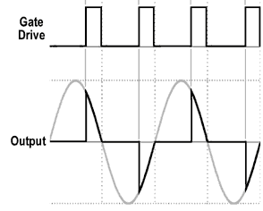

# Microcontrolled Light Bulb Dimmer

A [*light bulb dimmer*](https://en.wikipedia.org/wiki/Dimmer) project created using a __PIC microcontroller__ programmed in C (ANSI) language. It was one of the  requirements on the microcontrollers discipline of my [university](https://spo.ifsp.edu.br/).

#### What does it do? ####

A <a href="https://en.wikipedia.org/wiki/Dimmer">dimmer</a> is a device able to control the amount of power dissipated over other devices, it's a way to control loads. We created some funcionalities for the project such as:

1. Luminosity Control
0. Fade effect
0. Flash
0. Timer mode
0. Darkness detection function

To make it simple for people to use (because we believe that things made from people to people should be like that) we developed a Humam Machine Interface (HMI) with simple ajust buttons and an LCD Display (16x2). Since interface bugs are quite hard to debug, if you find any bug feel fre to notify us!

  
#### Is there any user manual available? ####

A user manual will soon be released on this readme file.

##### How does it work? ####

You may have heard that when you plug your devices on a power plug they are powered with <a href="https://en.wikipedia.org/wiki/Alternating_current" target="_blank">alternating current</a> (aka AC). We can control the brightness by changing the amount of power been dissipated over the load (in this context a bulb). Making a linear control can be quite dificult since our input signal (sine wave) is not something close to linear, but it can be done.

#### How is it done? ####

Keeping it simple: by creating a circuit to detect the zero of the sine wave (aka zero-crossing) we can measure time and then trigger a switch with a PWM to allow AC voltage to get to the bulb.

  
  
The DC signal from the microcontroler triggers the AC signal

#### Can I just copy/paste your code? ####

This code is open-source, but you should pay attention a few things like:

<ul>
  <li>In Brazil we use 60Hz, but it is a fact that some countries work with 50Hz AC frequency, which means you might need to change some equations used on the code.</li>
  <li>Another point is the hardware. Since this project is an embadded system it is very hardware dependent - like for example the crystal frequency used to generate the clock for the PIC microcontroller, which affects the timers - we recomend you to keep the same hardware.</li>
</u>
